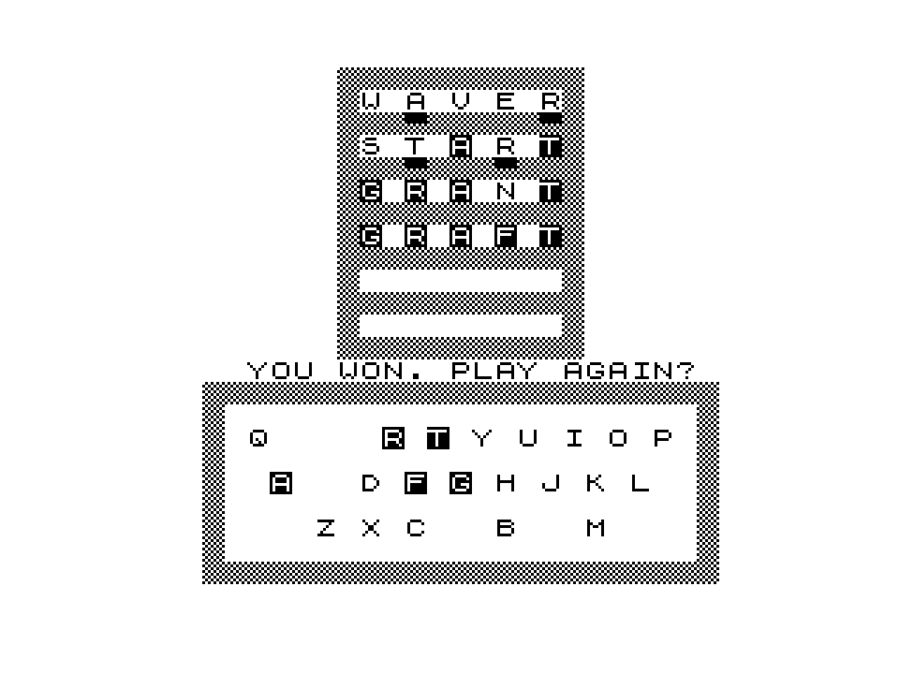

# WORD81
A wordle-like game for the Sinclair ZX81 and Timex Sinclair 1000.

# Features
- Guess a secret 5-letter word in up to 6 tries, inspired by Wordle.
- 2048 possible words to guess from, with a dictionary of over 4600 words.
- On each guess, the game provides feedback for each letter:
	- Correct letter in the correct position (Marked with a solid block)
	- Correct letter in the wrong position (Marked with an underline)
	- Incorrect letter (Not marked or removed from on-screen keyboard)
- Built-in dictionary validation: only valid 5-letter words (for a dictionary of over 4600) are accepted.
- Designed for the ZX81 and Timex Sinclair 1000, running in 16K RAM.

# Play Online
You can play Word81 online [here](https://zx81.yarbsemaj.com/?id=word81)

# Building
`zmac main.asm; cp zout/main.cim zout/main.p`

# Acknowledgments
Wordle concept by [Josh Wardle](https://en.wikipedia.org/wiki/Wordle_(game))

Word List from [darkermango/5-Letter-words](https://github.com/darkermango/5-Letter-words?tab=readme-ov-file) and [jonathanwelton/word-lists](https://github.com/jonathanwelton/word-lists/blob/main/5-letter-words.json)

Boilerplate libs provided by [Tim Swenson](http://swensont.epizy.com/?i=1)

